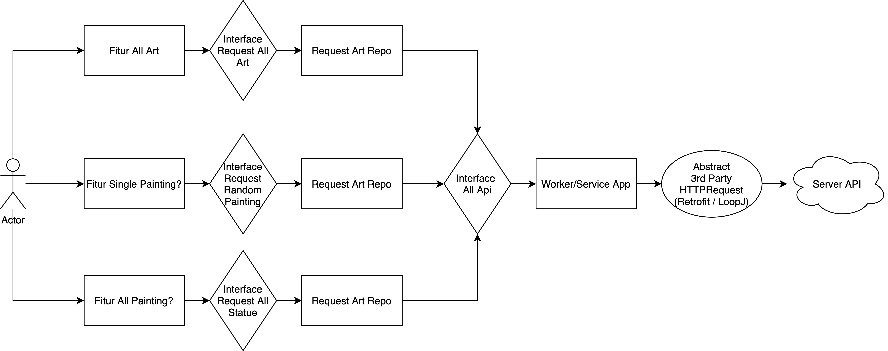

# PaintingAndStatue
Implementasi aplikasi sederhana dengan tema Lukisan dan Patung (Painting & Status) dengan menggunakan recyclerview, bottomnavigation, multiple fragment.

Project ini untuk menjelaskan konsep interface dan abstraction secara sederhana. Ditambah dengan mengimplementasikan SOLID principle.

Arsitektur sederhana untuk projects ini:

